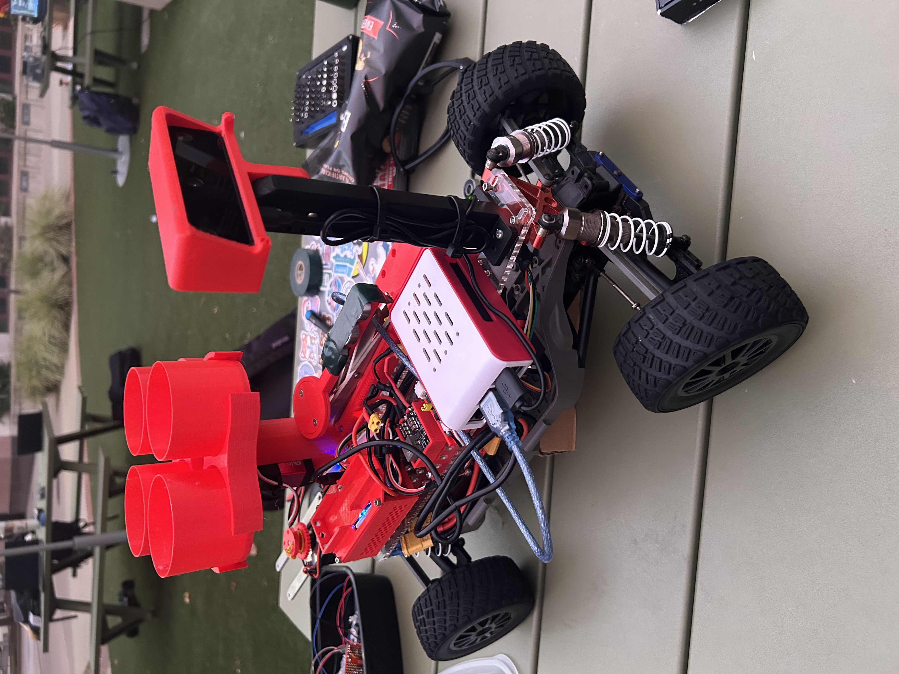
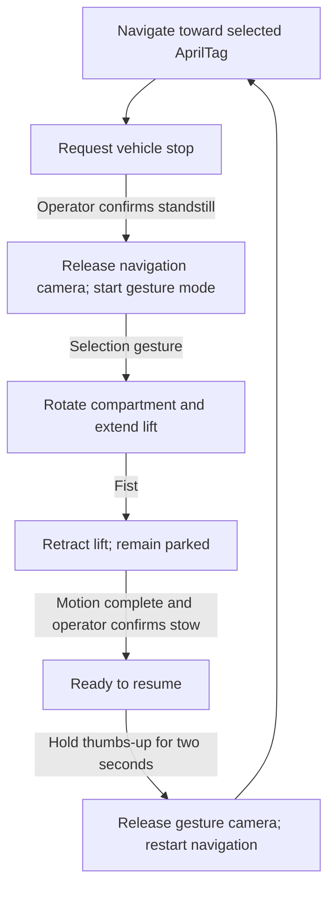

# RoboButler — Person-Following Rover with Gesture-Controlled Item Access

A robotics prototype developed for **UC San Diego ECE/MAE 148**, designed to follow an AprilTag target and provide access to stored items through a rotating compartment and motorized scissor lift.

**My role:** Hardware integration, Raspberry Pi–Arduino communication, motor control, power distribution, and debugging.



## Overview

Walking between classes across UCSD's large campus can be tiring, especially while carrying a heavy backpack. Our team explored a robot that could follow a student carrying an AprilTag and transport some of their belongings.

At the destination, hand gestures select a compartment position and extend a stepper-driven scissor lift to make items easier to reach. A fist commands the lift to retract. The intended lift travel was approximately a couple of feet; measured travel and payload capacity have not been established.

**Project status:** Navigation and gesture-controlled actuation were tested separately during the course. This repository also contains a **post-course, software-tested integration prototype** that coordinates both subsystems. The integrated application has **not been tested on the physical robot**, which I no longer have access to after completing the course.

## Course Demonstrations

These videos document the course prototype and subsystem work. They do not demonstrate the later integrated application.

- [Hand Gesture Control Demonstration](https://youtu.be/hY5M1MJWAxY)
- [AprilTag Detection Demonstration](https://youtube.com/shorts/GXT1gASVuJs)

## My Contributions

My work focused on connecting and debugging the robot's electronics and actuators:

- Integrated Raspberry Pi-to-Arduino Mega USB serial communication for gesture-driven motor commands.
- Developed Arduino control for compartment servo positioning and stepper-driven lift extension and retraction.
- Wired and configured the DRV8825 stepper driver and investigated motor response and connection issues.
- Integrated power distribution for the vehicle electronics, servo, and stepper motor.
- Troubleshot wiring, serial communication, actuator operation, and driver overheating.
- Adjusted the driver's current-limit setting during hardware debugging.

One stepper driver overheated and was replaced. I recall reducing the replacement driver's reference voltage from approximately **1.0 V to 0.5 V** while troubleshooting heat. These are recalled Vref settings, not verified motor-current measurements; the current relationship depends on the actual driver module.

Navigation software and mechanical design were team efforts. The later integration prototype was developed with AI assistance to explore the remaining software coordination problem.

## How the Integrated Prototype Works

The Raspberry Pi runs a coordinator that manages navigation, camera ownership, gesture recognition, and Arduino commands. Because the navigation and gesture code use different DepthAI APIs, they run in **separate Python environments**, with only one vision process owning the OAK-D Lite at a time.



The coordinator keeps the Arduino connection open across mode changes and requires a camera worker to release its resources and exit before starting the next worker. Gesture processing runs independently of the optional video preview.

**A completed movement command does not prove physical position.** Hardware mode still requires operator confirmation that the vehicle has stopped and that the lift is stowed. Thumbs-up replaces the typed resume command after stow confirmation. Navigation then requires a fresh observation of the selected tag; if the tag remains within the arrival threshold, the vehicle stays parked.

### Gesture Commands

| Gesture | Requested action |
|---|---|
| Point | Servo to 0°, then extend the lift |
| Peace | Servo to 90°, then extend the lift |
| Thumb, index, middle, and ring extended; pinky folded | Servo to 180°, then extend the lift |
| Open palm | Servo to 270°, then extend the lift |
| Fist | Retract the lift and remain parked |
| Upright thumbs-up held for two seconds | Resume navigation after confirmed stow |

These angles are inherited software settings. The physical servo's supported travel and pulse range still need verification. Additional compartment selections are blocked while the lift is extended or an actuator command is pending.

## Hardware and Software

| Area | Components and tools |
|---|---|
| Computing and vision | Raspberry Pi, OAK-D Lite, Arduino Mega |
| Vehicle control | RC chassis, VESC motor controller, drive motor, steering servo |
| Item access | Compartment servo, stepper motor, DRV8825 driver, scissor lift |
| Power | Approximately 15 V LiPo, anti-spark switch, actuator conversion to 5 V for the servo and 12 V for the motor supply |
| Navigation | AprilTag detection, RGB/depth processing, FastSAM, Pure Pursuit control |
| Gesture recognition | MediaPipe Hands, rule-based classification, gesture stability filtering |
| Integration | Python processes, USB serial, command acknowledgements, nonblocking Arduino firmware |

The navigation controller is named `mpc_controller.py`, but implements **Pure Pursuit steering and proportional command generation**, not optimization-based MPC. EKF code is present, but estimated velocity is overridden in the controller; this is not validated EKF-based speed feedback.

Hardware resources: [power distribution](hardware/schematics/power_distribution.png), [actuator wiring drawing](hardware/schematics/DRV8825_wiring_diagram.png), and [CAD files](hardware/cad/). The drawings document the project and require verification against the actual components before rebuilding. The CAD collection includes inherited chassis designs; a mount's presence does not establish that its corresponding sensor was used on RoboButler.

## Validation and Limitations

| Scope | Evidence and status |
|---|---|
| Course hardware work | Separate navigation and gesture/actuator subsystem testing |
| Integration software | Recorded run of **62 automated tests passing**, with no skips |
| Simulated sequence | Navigation → gesture mode → extension → retraction → confirmed stow → thumbs-up → navigation |
| Full robot integration | Not physically tested |

The automated checks exercise mode transitions, camera-process handoff, stale observations, serial failures, command acknowledgements, resume conditions, and firmware behavior with mocked hardware. The demo uses synthetic observations and simulated devices; it does not simulate vehicle dynamics, camera recognition accuracy, or lift mechanics. The firmware check compiles against host-side Arduino mocks, not the Mega toolchain.

Remaining work requires robot access: verify stopping and holding behavior, servo limits, stepper direction and travel, lift position sensing, payload capacity, Pi dependency compatibility, perception performance, and the complete operating sequence. Zero VESC duty may allow coasting and does not establish physical standstill.

See the [validation report](docs/validation.md), [recorded test output](docs/test-results.txt), and [demo output](docs/demo-output.txt).

## Try the Software Demo

From the repository root, using Python 3.10 or newer:

```bash
python run_robot.py --demo
```

No robot, camera, Arduino, DepthAI, or MediaPipe installation is needed for this demo. It should finish with:

```text
PASS: navigation -> gesture -> extend -> retract -> confirmed stow -> thumbs-up -> navigation
```

Run the automated checks with:

```bash
python -m unittest discover -s tests -v
```

Most checks use only Python's standard library. Three controller checks require NumPy, and the firmware check requires `g++`; those checks are skipped if their dependencies are unavailable. On Windows, use `py` if `python` is unavailable.

Hardware operation uses separate navigation and gesture environments and verified USB device identities. See the [integration guide](docs/integration-guide.md) for configuration, operator confirmations, and hardware prerequisites.

## Repository Guide

| Location | Contents |
|---|---|
| `run_robot.py` | Entry point for the demo and supervised hardware mode |
| `software/integration/` | Coordinator, process management, serial interfaces, and simulation |
| `software/navigation/` | Adapted team navigation code and FastSAM model |
| `software/gesture_control/` | Gesture classification and optional video preview |
| `software/arduino/` | Updated servo/stepper firmware for the integration protocol |
| `tests/` | Automated software tests and hardware mocks |
| `docs/` | Integration guide, serial protocol, validation, and source attribution |
| `hardware/` | Power and wiring drawings, CAD, and mounting designs |
| `media/` | Prototype photographs and assembly images |
| `archive/software/` | Original course subsystem code |

The original gesture application used Flask. The integrated application uses an optional read-only preview without Flask. Its Arduino firmware also uses an updated command protocol, so the archived sketch is not interchangeable with the integrated firmware.


## Team Project and Credits

Developed for **ECE/MAE 148 — Introduction to Autonomous Vehicles**, University of California, San Diego, Spring 2026.

This personal portfolio repository highlights my hardware integration, Arduino actuation, power distribution, and debugging contributions. Team-developed navigation software and mechanical designs are retained with attribution; post-course integration changes are documented separately from the original hardware work.

- [Original team repository](https://github.com/UCSD-Silberman-Classes-and-Projects/spring-2026-final-project-team-17)
- [Source attribution and integration changes](docs/sources.md)
