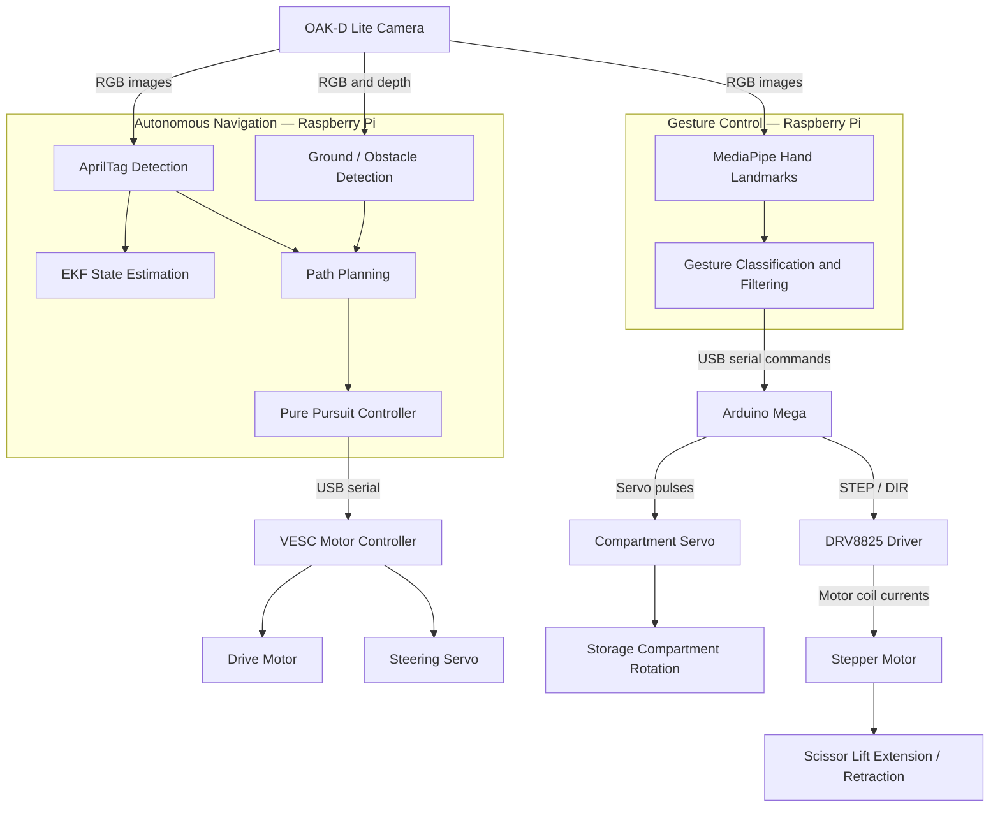

# Robobutler — Person-Following Rover with Gesture-Controlled Item Access

A robotics prototype developed for **UC San Diego ECE/MAE 148** that combines AprilTag-based navigation with a rotating storage compartment and a motorized scissor lift.

**My role:** Hardware integration, Arduino motor control, power distribution, and system debugging.

## Overview

Walking between classes across UCSD's large campus can be tiring, especially while carrying a heavy backpack. Our team wanted to explore a robot that could follow a student and carry some of their belongings.

Robobutler uses an **AprilTag as the visual target** for following a person. To make stored items easier to reach, the design combines a **servo-driven rotating compartment** with a **stepper-driven scissor lift**. Hand gestures select a compartment position and command the lift to extend or return. The intended lift travel was approximately a couple of feet, bringing items closer to the user's reach.

The project consists of two subsystems: autonomous navigation and gesture-controlled actuation. **These subsystems were tested separately; automatic transition from navigation to gesture control remains future work.** The prototype explores the campus carrying concept; backpack payload capacity and full campus operation have not been established in the project documentation.

https://youtu.be/hY5M1MJWAxY

https://youtube.com/shorts/GXT1gASVuJs

## My Contributions

My work focused on connecting the robot's electronics, power system, and actuators:

- Integrated Raspberry Pi-to-Arduino Mega USB serial communication to translate gesture commands into motor actions.
- Developed Arduino control for servo positioning and stepper-driven extension and retraction of the mechanism.
- Wired and configured the DRV8825 stepper driver, including STEP/DIR control and motor connections.
- Designed and tested power distribution for the motors and control electronics.
- Tuned the stepper driver's current limit and investigated overheating and unreliable motor operation.
- Tested and debugged wiring, serial communication, and actuator response during subsystem integration.

The navigation software and mechanical design were team efforts. This repository highlights my hardware and actuation contributions while documenting the broader project.

## Intended Operation

1. The user carries an AprilTag that serves as the robot's tracking target.
2. The rover navigates toward the tag while carrying items.
3. After the rover stops near the user, a hand gesture selects a storage position.
4. The servo rotates the compartment, and the stepper motor extends the scissor lift to present the items.
5. A fist gesture commands the lift to return.

This sequence describes the intended integrated experience. Navigation and gesture actuation currently run as separate subsystems.

## System Architecture

### Autonomous Navigation

The OAK-D Lite supplies RGB and depth data for AprilTag detection and ground/obstacle perception. The navigation code includes FastSAM segmentation, EKF state estimation, path planning, and a Pure Pursuit-based controller that sends throttle and steering commands through the VESC.

Although the controller source is named `mpc_controller.py`, the included implementation uses a geometric Pure Pursuit approach rather than an optimization-based MPC controller. EKF code is present, but the current controller does not use its estimated velocity for speed feedback.

### Gesture-Controlled Actuation

The Raspberry Pi processes OAK-D Lite images with MediaPipe Hands and sends text commands to the Arduino Mega over USB serial. The Arduino positions the compartment servo and sends STEP/DIR signals to the DRV8825 to move the scissor lift.

The firmware supports four configured compartment positions. Once the lift is extended, additional position-selection commands are ignored until a return command retracts it. A Flask video stream displays gesture recognition results for testing.

## System Signal Flow

**Note:** Navigation and gesture-controlled actuation were tested separately. Automatic switching between them remains future work. The EKF branch is shown separately because the current controller does not use its estimated velocity for speed feedback. Power wiring is omitted from this diagram.

## Hardware and Software

| Area | Components and tools |
|---|---|
| Computing and vision | Raspberry Pi, OAK-D Lite, Arduino Mega |
| Vehicle control | RC car chassis, VESC motor controller, drive motor, steering servo |
| Item access | Compartment servo, stepper motor, DRV8825 driver, scissor-lift mechanism |
| Power | LiPo battery, DC-DC converters / UBEC, motor and logic power wiring |
| Software | Python, Arduino C/C++, DepthAI, OpenCV, MediaPipe, PySerial, Flask |
| Navigation | AprilTag detection, NumPy/SciPy, FastSAM, Pure Pursuit control |

## Results and Limitations

The team repository documents separate testing of the navigation and gesture-control subsystems, including camera processing, VESC command output, Raspberry Pi-to-Arduino communication, and servo/stepper operation.

Remaining work includes:

- Integrating the automatic transition from navigation to gesture mode.
- Coordinating access to the shared OAK-D Lite camera.
- Improving navigation tuning and testing repeatability.
- Measuring lift travel, payload capacity, and reliability under load.
- Validating the complete carrying-and-item-access sequence.

The existing navigation code uses **DepthAI 2.x**, while the documented gesture setup uses **DepthAI 3.6.1**. These versions require separate software environments unless the code is updated.

## Repository Guide

The portfolio repository is organized around the following areas:

| Folder | Contents |
|---|---|
| `software/gesture_control/` | Raspberry Pi gesture recognition and serial communication |
| `software/arduino/` | Servo and stepper control firmware |
| `software/navigation/` | Team navigation code and setup notes |
| `hardware/` | Wiring diagrams, power distribution, component details, and selected CAD files |
| `docs/` | Testing results and debugging notes |
| `media/` | Prototype photos, diagrams, and demonstration images |

<!-- Populate these folders before publishing this guide. -->

## Demonstrations

<!-- Add real media before publishing:
- A short video showing compartment rotation, lift extension, and retraction.
- A separate AprilTag navigation video, labeled as a subsystem demonstration.
- Photos of the mechanism in its lowered and raised positions.
Use a video-hosting link for full videos rather than committing large video files.
-->

Demonstration media will document navigation and gesture-controlled actuation separately.

## Team Project and Credits

Developed for **ECE/MAE 148 — Introduction to Autonomous Vehicles**, University of California, San Diego, Spring 2026.

This is a personal portfolio version of a team project. My contributions focus on hardware integration, power distribution, Arduino actuation, and debugging. Team-developed navigation software and mechanical designs are included with attribution.

[Original team repository](https://github.com/UCSD-Silberman-Classes-and-Projects/spring-2026-final-project-team-17)

<!-- Add teammates' names and specific design/code credits when copying their work. -->

