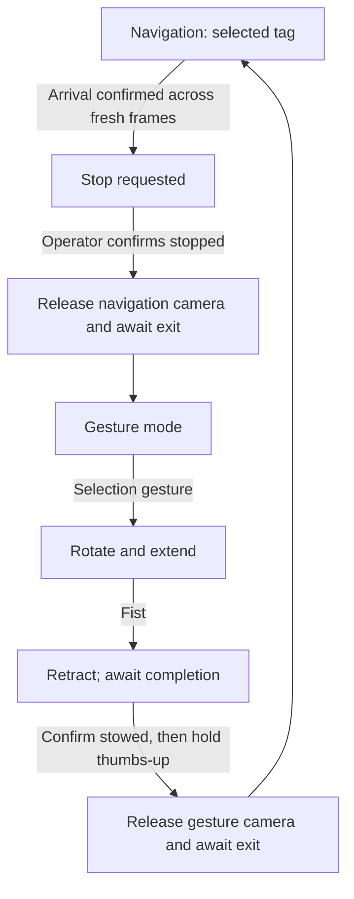

# RoboButler: integrated navigation and gesture control

A runnable integration candidate based on UCSD ECE/MAE 148 team 17's source at commit `5b2ddda989908b18566bfb2381e0f541582ae974`.

**Start with the simulator. No robot, camera, Arduino, DepthAI, or MediaPipe installation is needed for the demo.** Hardware mode is separately configured and remains untested on the robot. This package replaces the earlier Step 1 ZIP as the integration workspace; extract it into a new folder rather than mixing versions.

The thumbs-up update changes the Python coordinator/classifier and demo. If you already installed the integrated `ROBOBUTLER1` Arduino firmware from the preceding package, it does not need another update for this gesture.

## Run on your computer

Extract the ZIP, open a terminal in the `Robobutler_Integrated` folder, and run:

```bash
python run_robot.py --demo
```

On Windows, if `python` is unavailable but the Python launcher is installed:

```powershell
py run_robot.py --demo
```

Python 3.10+ is recommended. The demo uses only the Python standard library. It starts real child processes with synthetic camera observations, simulates Arduino replies, and exercises the same coordinator and serial-response parser used in hardware mode. It should finish in a few seconds with:

```text
PASS: navigation -> gesture -> extend -> retract -> confirmed stow -> thumbs-up -> navigation
```

It then shuts down and releases its simulated camera. A loopback socket on port 47831 represents exclusive camera ownership; no external network connection is made. Run one demo/test suite at a time. If that port is already in use, close the other demo or choose `simulation_camera_port` in your config.

Run the tests:

```bash
python -m unittest discover -s tests -v
```

Most tests need only Python. Three actual path-controller tests require NumPy. The optional native Arduino test requires `g++`; those tests are reported as skipped when their dependencies are unavailable. To include the controller checks, install NumPy in a test environment. The validation included with this package ran all tests without skips. See `docs/validation.md` and `docs/test-results.txt`.

## What is integrated

- A single coordinator controls navigation, stopping, camera release, gesture mode, actuator motion and return to navigation.
- Navigation and gesture camera workers use separate interpreters, retaining DepthAI v2 and v3 respectively.
- One parent-owned VESC writer accepts expiring drive commands. It continues sending zero duty during gesture mode, worker startup and handoff.
- One Arduino USB connection stays open for the entire session. Switching camera workers does not reopen/reset the Arduino.
- Navigation must release its camera **and exit successfully** before the gesture worker is launched; the same rule applies in the other direction.
- Gesture inference runs continuously on fresh frames, whether or not anyone opens the optional preview.
- Five fresh observations stabilize a gesture. Holding a gesture fires it once; changing to another stable gesture permits a new command. Three neutral frames rearm the same gesture.
- Command IDs and ACK/DONE replies associate each movement with its completion. The coordinator accepts only one actuator command at a time.
- The near-target controller now uses a valid closer endpoint instead of rejecting all waypoints within 1.2 m.
- Arrival is latched by the coordinator. Tag movement does not automatically restart the vehicle while serving the user.

## Mode sequence and return behavior



The full supervisor also includes BOOT, worker-startup, FAULT and SHUTDOWN states. See `software/integration/core.py`.

**Fist retracts and leaves the vehicle parked.** It never directly resumes driving. Resume requires completed motion, a physical stow confirmation and an upright thumbs-up held for two seconds. The typed `resume` command is no longer accepted. On re-entering navigation, the robot needs a fresh observation of the same selected tag. If the tag is still inside the arrival threshold, it stays parked.

Because the reviewed robot has no established physical standstill or lift-home feedback, this implementation uses local operator confirmations in hardware mode. The simulator supplies those observations automatically as test inputs. A firmware DONE message never becomes proof of physical retraction. Automatic unattended transitions would require verified sensing and stop/hold behavior, not just changing a software flag.

## Included files

| Location | Purpose |
|---|---|
| `run_robot.py` | Single entry point for demo and supervised hardware operation |
| `config.example.json` | Mode thresholds, deadlines, device paths, interpreter paths |
| `software/integration/core.py` | Shared mode logic and interlocks |
| `software/integration/processes.py` | Starts/stops vision workers and validates their messages |
| `software/integration/vision_worker.py` | Production navigation and gesture camera loops |
| `software/integration/hardware.py` | Persistent Arduino protocol and VESC command-expiry thread |
| `software/integration/simulation.py`, `sim_worker.py` | Fake devices and synthetic camera subprocesses |
| `software/navigation/` | Adapted team navigation code and original FastSAM weights |
| `software/gesture_control/` | Landmark classifier, optional read-only preview, dependencies |
| `software/arduino/project_servo_stepper/` | New nonblocking firmware with the integration protocol |
| `tests/` | Coordinator, serial, subprocess, controller, vision-worker and firmware checks |
| `docs/` | Validation results, protocol, limitations and source attribution |

## Gesture mapping

| Gesture | Command | Requested action |
|---|---|---|
| Point | `Command_1` | Servo 0°, then extend |
| Peace | `Command_2` | Servo 90°, then extend |
| Thumb + index + middle + ring, pinky folded | `Command_3` | Servo 180°, then extend |
| Open palm | `Command_4` | Servo 270°, then extend |
| Fist | `RETURN` | Retract; remain parked |
| Upright thumbs-up, four fingers folded | Supervisor only | Hold for two seconds after confirmed stow to return to navigation |

The original FOUR-finger condition was mislabeled THREE. This package calls it `FOUR`; the physical rule and command mapping are otherwise retained. The rule-based classifier remains orientation-sensitive and has not been visually revalidated here. Keep the thumb pointing upward in the camera image with the other four fingers folded. A missing hand, another gesture, or a gap over 0.3 seconds between fresh detections restarts the resume hold. The hold starts only after stow acknowledgement and no pending actuator command. Its duration and maximum capture gap are configurable as `resume_hold_seconds` and `resume_max_gap_seconds`.

## Hardware setup — for a later robot session

You do not need these steps to run the demo.

1. Retain a backup of the team firmware. The new host requires the new `ROBOBUTLER1` firmware in this package; the old sketch's free-text replies are incompatible. Open `software/arduino/project_servo_stepper/project_servo_stepper.ino` in Arduino IDE, select Arduino Mega and compile/upload during a supervised bench session. The host-side test is not an AVR-board compilation.
2. Verify the actual servo permits the existing 500–2500 µs / 270° mapping. Verify DRV8825 wiring, current setting, direction, microstepping and travel. The existing 300 pulses per movement and 1000 µs half-period are retained as configuration, not measured revolutions or safe lift limits. Pins remain servo D5, DIR D2, STEP D3, baud 9600; enable D8 remains unused.
3. Create/reuse separate Pi environments. Install `requirements.txt` in the supervisor environment, `software/navigation/requirements.txt` in the navigation environment and `software/gesture_control/requirements.txt` in the gesture environment. Do not merge the DepthAI v2/v3 dependencies into one environment. Pi wheel availability and full dependency resolution were not tested here.
4. Copy `config.example.json` to `config.local.json`. Set both absolute Python interpreter paths and physically verified, distinct `/dev/serial/by-id/` device paths. No numbered-port fallback exists. The software cannot independently authenticate the VESC from the path name.
5. Set the selected AprilTag ID and measured black-square tag size. `0.15 m` and arrival distance `0.5 m` are inherited starting values, not calibration results. Arrival is camera-to-tag range, not bumper clearance. Establish actual stopping/holding behavior and the VESC's own loss-of-command timeout. Zero duty can coast and does not guarantee a stationary vehicle.
6. Only after reviewing those hardware settings, set `hardware_reviewed` to `true` and run:

```bash
python run_robot.py --hardware --config config.local.json
```

The original team model file is included at `software/navigation/FastSAM-s.pt`. Paths in config for model weights are relative to the package folder; interpreter paths must be absolute.

The terminal commands are:

| Command | Meaning |
|---|---|
| `stowed` | Confirm you physically checked that the lift is retracted and the compartment is safe for vehicle movement; records the state through the Arduino protocol |
| `start` | Begin navigation after startup stow acknowledgement |
| `stopped` | At STOPPING, confirm the vehicle is physically stopped and held stationary; allows handoff to gestures |
| `status` | Show mode, lift state and pending command |
| `quit` | Request shutdown |

At startup: `stowed`, wait for `ACTUATOR STOWED`, then `start`. At arrival: verify standstill, then `stopped`. After using gestures and retracting: verify stow, issue `stowed`, wait for acknowledgement, then hold an upright thumbs-up for two seconds. You no longer type `resume`.

Optional preview: set `preview_port` to `5000` and visit `http://127.0.0.1:5000` on the Pi. For viewing from a laptop use an SSH port forward, e.g. `ssh -L 5000:127.0.0.1:5000 pi@YOUR_PI`, then open the laptop's `http://127.0.0.1:5000`. The preview is read-only, only available during gesture mode, and can be left disabled.

## Failure behavior and limits

- Target loss or obstruction withdraws the driving command. A different tag cannot take over.
- Stale frames, startup/release timeouts, worker crashes, serial errors, missing movement completion and Arduino reset latch FAULT. There is no automatic reconnect-and-drive path.
- A VESC writer thread expires drive permission even if the supervisor stops refreshing it. Pi/process failure still requires a controller-side timeout; the software thread is not a hardware emergency stop.
- On fault/shutdown, the host requests zero drive and sends Arduino STOP. Firmware stops generating step pulses, invalidates position and holds existing outputs. It does not automatically retract, detach the servo or disable stepper holding torque.
- Recovery requires resolving the failure and restarting, with physical state verification. Reopening USB may reset the Mega. The new sketch makes no servo move at boot, but electrical/mechanical reset behavior still needs testing.
- Existing perception and path-planning algorithms are retained. FastSAM, AprilTag accuracy, obstacle masking, camera calibration, speed, slopes, payload and physical stops have not been validated by these tests. The controller still overrides EKF velocity with zero, and the bridge retains its 0.07 fixed positive-duty mapping. This is not validated closed-loop speed control.
- Freshness thresholds can cause faults on an overloaded Pi. Measure processing latency before tuning them; increasing a timeout also increases the maximum age of a drive request.

No changes were pushed to the team repository. Keep this separate integration candidate distinguishable from the team's previously demonstrated subsystem work.
